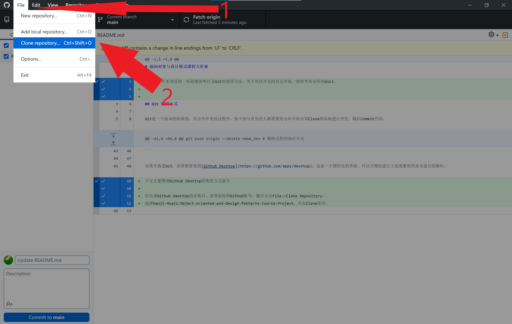
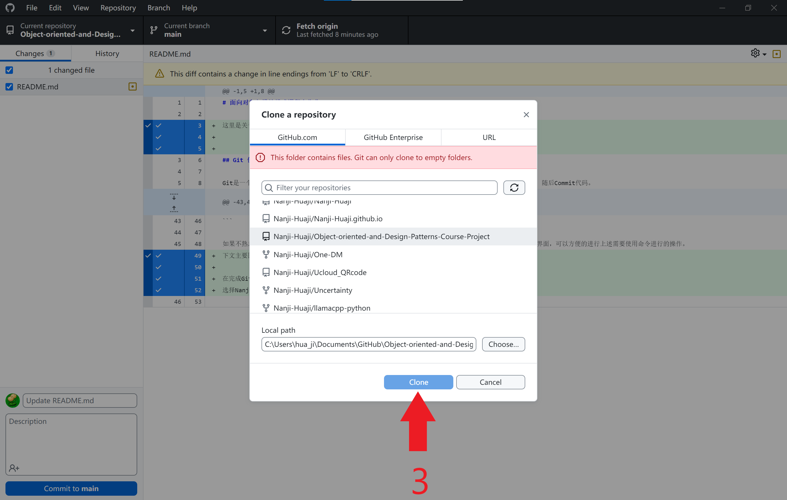
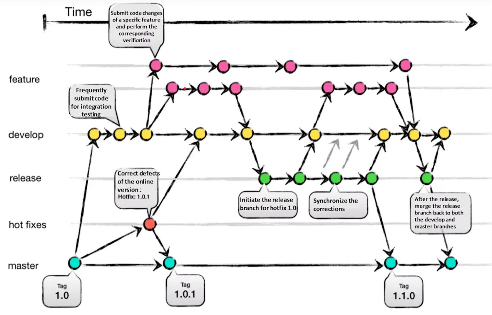

# 面向对象与设计模式课程大作业

这里是关于本项目的一些简要说明以及Git的使用方法，关于项目开发的其它内容，请参考本仓库的Wiki。


## Git 使用方式

Git是一个版本控制系统，在合作开发的过程中，每个参与开发的人都需要将仓库中的内容Clone到本地进行开发，随后Commit代码。
Github是一个代码托管平台，用于放置这个项目的源代码。

Git是通过命令进行管理的，如果你准备使用命令行，可以参考以下命令：

第一次使用
```bash
git clone https://github.com/Nanji-Huaji/Object-oriented-and-Design-Patterns-Course-Project.git
将你的文件复制到这个文件夹下

```
和团队其他人合并
```bash
git pull # 拉取别人的代码，默认自动合并，如果有冲突，vscode会有提醒，请手动合并
git add . # 将所在文件夹下的所有的文件 添加跟踪
git commit -m "simple English" # 你要提交的消息
# git branch -M main # 第一次需要使用
# git remote add origin https://github.com/Nanji-Huaji/Object-oriented-and-Design-Patterns-Course-Project.git 第一次需要使用，如果是clone下来的不用
git push -u origin main # 将本地的main分支提交到远程 origin 分支上，不要强制提交，记得开setproxy
```
个人新分支的创建与合并
```bash
# 各人也可以开一个自己的name_dev分支用于个人开发，随后合并到主分支上，便于最终代码的维护
git checkout main    # 切换到 main 分支
git pull origin main # 拉取最新的 main 分支代码

git checkout -b name_dev # 创建并切换到 name_dev

git add .         # 暂存所有修改
git commit -m "描述你更改的消息" # 提交更改

git checkout main  # 切换回 main 分支
git merge name_dev # 将 name_dev 合并到 main

git push origin main # 将本地 main 分支推送到远程

git branch -d name_dev # 删除本地的临时分支
git push origin --delete name_dev # 删除远程的临时分支
```

如果不熟悉Git，非常推荐使用[Github Desktop](https://github.com/apps/desktop)。这是一个图形化的界面，可以方便的进行上述需要使用命令进行的操作。
下文主要围绕Github Desktop的使用方式展开

在完成Github Desktop的安装后，请登录你的Github账号，随后点击File->Clone Repository，
选择Nanji-Huaji/Object-oriented-and-Design-Patterns-Course-Project，点击Clone，即可将仓库Clone到本地，如图所示：





在添加完项目后，可以在Github Desktop中通过vscode或者其它你所喜欢的编辑器/IDE打开项目，这样就可以正常的编辑项目了。

如果你完成了一部分工作，准备commit你的代码，可以直接在Github Desktop中点击Commit to main（如果你没有另开新分支），随后点击Push to Origin。

这样，我们就了解了Github Desktop的基础用法。

## 补充说明：什么是分支？

分支（Branch）是为了在不影响主分支的前提下独立开发新功能或修复错误而做的，它允许你在不受他人打扰的情况下独自开发某个功能。在完成这个功能的开发后，
可以对分支进行融合（Merge），如果在融合的两个分支中，没有同时编辑的文件，那么分支可以顺利融合。否则就需要对冲突的文件进行修改。



